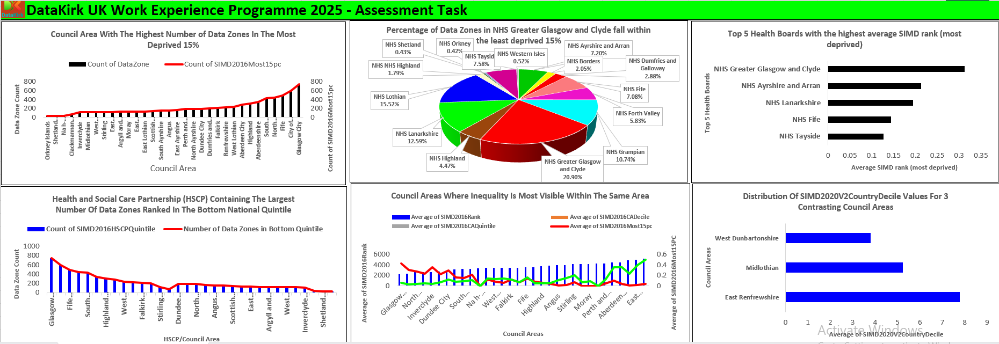

# DataKirk UK Work Experience Programme 2025
This project analyzes the 2025 DataKirk SIMD Assessment using Power BI to explore deprivation across Scottish council areas, health boards, and data zones. It identifies inequality hotspots and informs policy recommendations by visualizing open government data and geographic deprivation patterns.

**Title:** [DataKirk UK Work Experience Programme 2025](https://github.com/Osiwi/github.io/blob/main/simd2016_18052020_21052025.xlsx)

**Tools & Technologies Used:**
Microsoft Excel: Core platform used for data import, structuring, cleaning, transformation, and visualization.
Power Query (Excel): Employed for merging datasets, filtering by SIMD categories, and creating lookup joins using geography codes.
Excel Formulas & Functions: Used for calculating percentages, rankings, deciles, and correlation coefficients.
Pivot Tables & Pivot Charts: For dynamic aggregation and cross-tabulation of deprivation statistics.
Conditional Formatting: To highlight key insights such as top/bottom deciles and high deprivation zones.
Chart Types Used:
Clustered Bar & Column Charts: For comparing council areas and HSCP data.
Line and Combo Charts: For visualizing inequality patterns across rankings and quintiles.
Pie Charts: For showing distribution of data zones by health boards.
Dual-Axis Charts: To overlap decile and quintile data for deeper inequality insights.

**Project Description Overview:**
This project is an analytical response to the DataKirk 2025 Assessment Task, aimed at examining the Scottish Index of Multiple Deprivation (SIMD) data and related geography codes. The goal was to evaluate deprivation patterns across council areas, health boards, and data zones, and suggest policy interventions using data visualization. Open government datasets were integrated and explored using Power BI to assess where deprivation is most concentrated and where inequality within the same council areas is most visible.

**Data Sources:**
SIMD 2020v2 Dataset
Council Area 2011–2019 Codes
Health Board 2014–2019
Data Zone 2011
Health and Social Care Partnerships

**Objective:**
The objective of this project is to analyze and visualize deprivation patterns across Scotland using the Scottish Index of Multiple Deprivation (SIMD) and linked geography datasets. The analysis aims to:
Identify council areas and health boards with the highest concentration of deprivation.
Compare inequality within and across council areas using SIMD deciles, ranks, and quintiles.
Assess the distribution of deprivation across Health and Social Care Partnerships (HSCPs).
Evaluate correlation between SIMD deciles and population-weighted quintiles to assess metric consistency.
Support evidence-based policymaking by recommending targeted interventions based on spatial deprivation trends.
By leveraging Excel for data cleaning, transformation, and visualization, the project delivers actionable insights that can guide resource allocation, urban planning, and social policy in Scotland.

**Key Features Included in the Dashboard:**
This Excel-based dashboard was designed to explore deprivation patterns across Scotland using SIMD data. It includes the following features:
Council Area Deprivation Analysis
Bar and line combo chart highlighting each council area’s:
-Total number of data zones
-Number of zones in the most deprived 15% (SIMD2016Most15pc)
-Shows Glasgow City as having the highest concentration of deprived zones.
Health Board Inequality Distribution
-Pie chart visualizing the percentage of data zones in NHS Greater Glasgow and Clyde that fall in the least deprived 15%, revealing significant internal disparity.
Most Deprived Health Boards
Horizontal bar chart listing the top 5 health boards with the highest average SIMD rank (i.e., most deprived), including:
-NHS Greater Glasgow and Clyde
-NHS Ayrshire and Arran
-NHS Lanarkshire
-NHS Fife
-NHS Tayside
HSCP (Health and Social Care Partnerships) Burden Overview
-Dual bar-line chart displaying:
-Number of data zones in the bottom national quintile
-SIMD2016 quintile values by HSCP
-Identifies Glasgow City HSCP as the most affected.
Intra-Council Inequality Comparison
-Dual-axis chart plotting:
-Average SIMD decile (CA Decile)
-Population-weighted quintile
-Percentage in the most deprived 15%
-Highlights intra-council disparities in City of Edinburgh and North Ayrshire.
Contrasting Council Area Comparison
-Bar chart comparing West Dunbartonshire, Midlothian, and East Renfrewshire using the SIMD2020V2CountryDecile to show varying deprivation levels across contrasting councils.
Visual Storytelling
-Use of distinct color codes and chart layering to:
-Highlight key disparities
-Support interpretation of complex SIMD relationships
-Allow comparisons at national, regional, and local levels

**Key findings:**
Glasgow City has the highest number of data zones in the most deprived 15% (SIMD 2016).
21% of NHS Greater Glasgow and Clyde data zones fall in the least deprived 15%, yet the same health board also leads in average deprivation rank—indicating internal inequality.
Top 5 most deprived health boards by average SIMD rank:
-NHS Greater Glasgow and Clyde
-NHS Ayrshire and Arran
-NHS Lanarkshire
-NHS Fife
-NHS Tayside
Glasgow City HSCP contains the largest share of bottom national quintile data zones.
A very strong correlation (r ≈ 0.98) exists between council-level SIMD decile rankings and population-weighted quintile values, confirming metric reliability.
City of Edinburgh and North Ayrshire exhibit the highest intra-council inequality, with both affluent and deprived areas present side-by-side.

**Policy Recommendations:**
-Targeted Regeneration and Investment in Deprived Zones
Justification: Glasgow, Fife, and North Lanarkshire dominate the lowest SIMD percentiles.
Action:
Invest in place-based regeneration (housing, infrastructure, green space)
Focus on data zones within the lowest SIMD 15% across HSCPs
Expected Outcome: Job creation, infrastructure improvement, reduced social exclusion
-Integrated Health and Education Hubs in Mixed-Deprivation Councils
Justification: Councils like Edinburgh and North Ayrshire show internal disparity
Action:
Create “one-stop” hubs for healthcare, education, and family support
Locate within or near deprived zones for accessibility
Expected Outcome: Improved long-term health, education, and economic mobility

**Visual Summary:**
-Deprivation Count by Council (Bar)
-Intra-Area Inequality (Dual Axis Line & Bar)
-Distribution by Health Board (Pie)
-HSCP & SIMD Rank Insights (Combo and Clustered Bars)

**Dashboard Overview:** 

